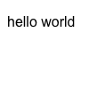

# puppetbox


> Capture screenshots of HTML using Chrome's headless mode.

## Requirements

- for node version, see [package.json](./package.json)

## Why puppetbox?

- Its [code base](https://raw.github.com/TimDaub/puppetbox/main/src) is tiny and maintainable.
- It's framework-agnostic. All that is needed to get started is a HTML string.

## Installation

```bash
$ npm i -D puppetbox
```

## Usage

puppetbox allows you to capture screenshots using headless Chrome by entering a
HTML string. For visual regression testing, a screenshot could later be
compared using [`looks-same`](https://github.com/gemini-testing/looks-same).

```js
import { capture, htmlEnvelope } from "puppetbox";
import { writeFileSync } from "fs";

(async () => {
  const input = htmlEnvelope("<p>hello world</p>");

  const screenshot = await capture(input, {
    height: 100,
    width: 100
  });
  writeFileSync(`example.png`, screenshot)
})();
```

screenshot of "example.png" below:



### Notes

- Headless Chrome renders an HTML string that is a valid and [minimal HTML
  document](https://github.com/TimDaub/mynimal-html5-boilerplate#%CE%BCnimal-html5-boilerplate)
  differently than passing in an HTML fragment. Compare ["hello world" as an
  HTML fragment](./assets/without_html_env.png) and ["hello world" embedded
  into a valid HTML document](./assets/with_html_env.png). We recommend consistant usage of
  embedding or using fragments. A utility function for embedding a HTML fragment into
  a minimal HTML boilerplate is provided with the `htmlEnvelope` function.

## Changelog

### 0.1.0

Stop embedding fragments in HTML doc. 

- Stop exporting `capture` as default
- Export `htmlEnvelope` function
- Add tests for `capture` and `htmlEnvelope` functions
- Add Note about how headless Chrome renders fragments differently from
  documents

### 0.0.1

- Release initial version

## License

See [License](./LICENSE).
